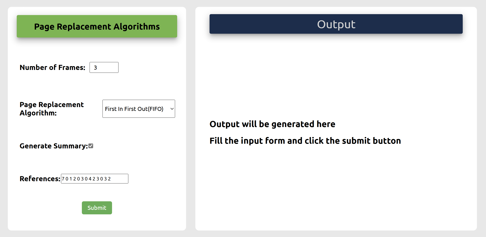

# Page Replacement Algorithm Visualizer

This is a web-based application that simulates and visualizes various page replacement algorithms. The application is designed to help users understand how different page replacement algorithms work by providing an interactive and visual representation of the algorithms in action.

## Table of Contents

- [Overview](#overview)
- [Features](#features)
- [Page Replacement Algorithms](#page-replacement-algorithms)
  - [First-In-First-Out (FIFO)](#first-in-first-out-fifo)
  - [Least Recently Used (LRU)](#least-recently-used-lru)
  - [Optimal Page Replacement](#optimal-page-replacement)
  - [Clock Algorithm](#clock-algorithm)
- [Usage](#usage)
<!-- - [Installation](#installation) -->

## Overview

The Page Replacement Algorithm Visualizer is an educational tool that helps users gain a deeper understanding of how operating systems manage memory. The visualizer allows users to input reference strings and observe how different page replacement algorithms handle page faults and memory allocation.



## Features

- **Interactive Visualization**: Watch how pages are replaced in memory based on the algorithm selected.
- **Multiple Algorithms**: Compare different page replacement strategies.
- **Custom Input**: Enter your own reference strings and see the results.
- **Real-Time Feedback**: Understand the performance of each algorithm through visual and numerical feedback.

## Page Replacement Algorithms

### First-In-First-Out (FIFO)
FIFO is the simplest page replacement algorithm. It replaces the oldest page in memory when a new page needs to be loaded.

### Least Recently Used (LRU)
LRU replaces the page that has not been used for the longest period of time. It approximates the behavior of the optimal algorithm but is easier to implement.

### Optimal Page Replacement
The Optimal algorithm replaces the page that will not be used for the longest period in the future. It provides the best possible performance but requires future knowledge of the reference string.

### Clock Algorithm
The Clock algorithm is a more efficient implementation of FIFO that uses a circular list (clock) to track the usage of pages. It approximates LRU with lower overhead.

## Usage

1. **Select an Algorithm**: Choose the page replacement algorithm you want to visualize.
2. **Enter Reference String**: Input the reference string (a sequence of page numbers) that the algorithm will process.
3. **Visualize**: Watch the algorithm in action as it processes the reference string, displaying page faults and memory allocation in real-time.

## Installation

To run the Page Replacement Algorithm Visualizer locally, follow these steps:

1. Clone the repository:
   ```bash
   git clone https://github.com/yourusername/page-replacement-visualizer.git
